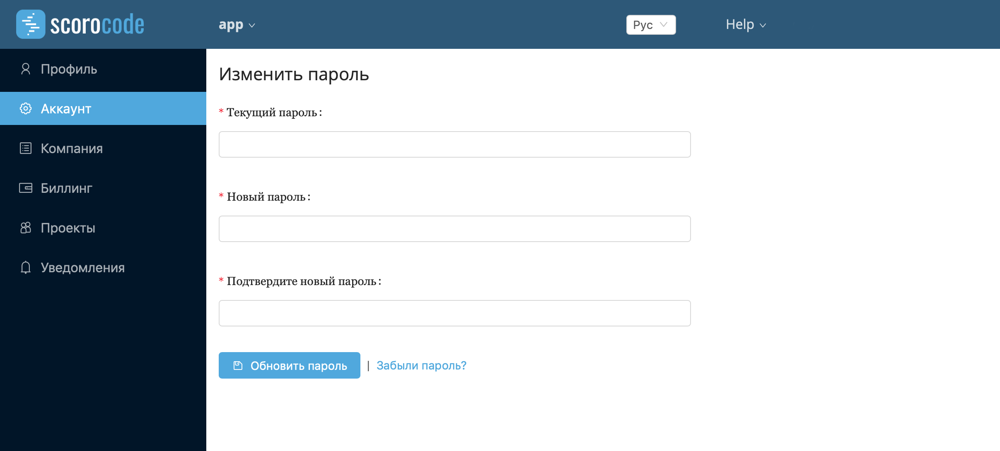
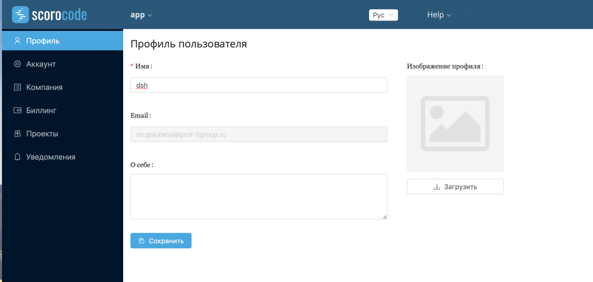
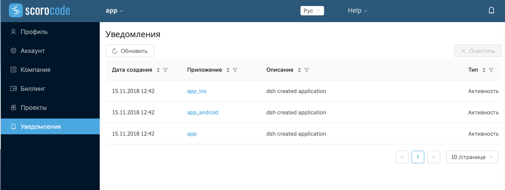

# Настройка профиля
## Как поменять пароль
Для того чтобы изменить пароль, в настройках пользователя перейдите на вкладку "Аккаунт", введите старый пароль и новый, подтвердите смену.

## Как изменить имя пользователя и почту
Для того чтобы изменить имя пользователя и почту, в настройках пользователя перейдите на вкладку "Профиль".

## Как просмотреть уведомления
Вся информация о действиях пользователя в личном кабинете собирается на вкладке "Уведомления". Также можно нажать на иконку колокольчика в верхнем правом углу для быстрого доступа к уведомлениям.

## Как посмотреть проекты
На вкладке "Проекты" отображаются все сторонние (созданные в другом личном кабинете) приложения, к которым пользователь имеет доступ.
