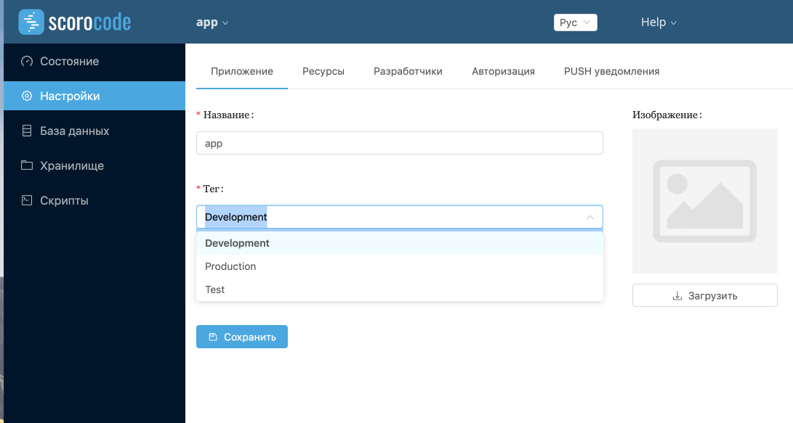
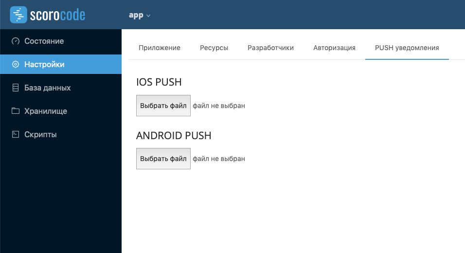

# КАК НАСТРОИТЬ ПРИЛОЖЕНИЕ
Из списка приложений выберите то, которое хотите настроить и вы попадете в меню приложения.
## Вкладка "Состояние"
Для того чтобы посмотреть состояние ресурсов приложения, какие процессы запущены и логи, нужно перейти на вкладку "Состояние".

## Вкладка "Настройки"
На вкладке "Настройки" можно изменить название приложения и его статус (development/test/production)

На вкладке "Ресурсы" можно изменить количество ресурсов, используемых приложением.

На вкладке "Разработчики" отображается владелец приложения и все сотрудники, имеющие доступ к приложению.

На вкладке "Авторизация" осуществляется авторизация и настройка базы данных.

На вкладке "PUSH уведомления" настраиваются пуши для iOS и Android приложений.

## БД/Хранилище/Скрипты
Для данного раздела прочитайте, пожалуйста, про [cli](/cli/howto)

**нет скринов, как это будет работать**