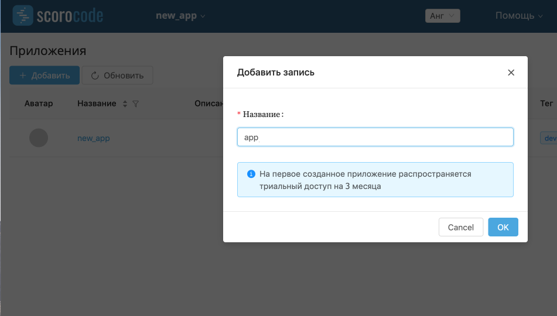

# Создание приложения

## Информация про создание приложения со скринами
Для создания приложения нажмите на кнопку "Добавить", во всплывающем окне введите название приложения и "ОК". 

## Список приложений
На вкладке "Приложения" отображается список всех существующих приложений и краткую информацию, включающую в себя дату создания, дату последнего изменения, статус разработки, название и описание. Здесь можно просмотреть приложение подробнее или удалить его.

Информация про создание приложения